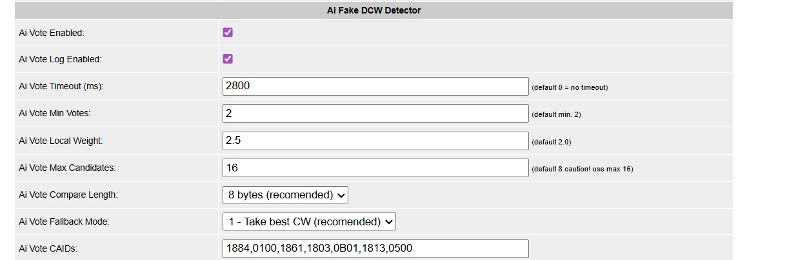

# OSCam with AI Fake DCW Detector

## Overview

This repository contains a modified version of **OSCam** enhanced with an advanced **AI-inspired Fake DCW Detection and Voting System**.

The goal of this system is to improve stability and reliability when multiple Control Word (CW) sources are available, such as:

- Local readers  
- CacheEx peers  
- CSP sources  
- Virtual readers  

Instead of accepting the first CW received, this implementation collects multiple candidates and selects the most reliable one using weighted voting logic.

---

# 🔍 Problem It Solves

In multi-reader or CacheEx environments, fake or unstable DCWs can appear.

Default behavior:
- First CW wins
- Possible glitches, freezing, or unstable decoding

With AI Fake DCW Detector:
- Multiple CWs are collected
- Sources are tracked
- Votes are counted
- Local readers can be weighted higher
- Majority or timeout logic is applied
- A reliable CW is selected

Result:

✔ Reduced fake DCWs  
✔ Increased decoding stability  
✔ Better CacheEx reliability  
✔ Smarter CW selection  

---

# 🧠 Core Functions

## 1️⃣ `cw_vote_add()`

This function is called whenever a new CW is received.

It:

- Compares the CW with existing candidates
- Increases vote count if it matches
- Adds a new candidate if it is unique
- Tracks:
  - Total votes
  - Local votes
  - Reader source
  - CW value
- Identifies whether the source is:
  - Local reader
  - Virtual reader
  - CacheEx client
  - CSP source

Each CW candidate is stored in a voting pool.

---

## 2️⃣ `cw_vote_decide()`

This function determines the final CW to use.

### Decision Process

1. Count total votes
2. Verify minimum vote requirement
3. Calculate effective score:
4. Check for majority (> 50%)
5. Apply timeout logic
6. Apply fallback strategy if necessary

If a winner is found:

- CW is copied into `er->cw`
- CacheEx hit statistics are updated
- Optional logging is performed

If no clear winner exists, the system waits for more votes unless timeout rules apply.

---

# ⚙ Configuration Options

| Parameter | Description |
|------------|------------|
| `cwvote_enabled` | Enable/disable voting system |
| `cwvote_max_candidates` | Maximum CW candidates stored |
| `cwvote_compare_len` | Number of bytes used for CW comparison |
| `cwvote_local_weight` | Weight multiplier for local votes |
| `cwvote_min_votes` | Minimum required votes before decision |
| `cwvote_timeout` | Timeout in milliseconds |
| `cwvote_fallback` | Fallback mode (1 = best candidate, 2 = first candidate) |
| `cwvote_log_enabled` | Enable detailed debug logging |

---

# 🏆 Winner Selection Logic

A CW is selected if:

- It has a strict majority (> 50%)  
OR  
- Timeout is reached and fallback mode allows selection  

If timeout occurs and:

- `fallback = 1` → best scoring candidate is selected  
- `fallback = 2` → first candidate (slot 0) is selected  

---

# 📊 Intelligent Source Awareness

The system distinguishes between:

- Trusted local readers
- Virtual readers
- CacheEx clients
- CSP sources

Local readers can be weighted higher using `cwvote_local_weight`, improving reliability in hybrid environments.

---

# 📈 CacheEx Integration

If the winning CW originates from CacheEx:

- `cwcacheexhit` counters are incremented
- Client and account statistics are updated
- Global hit statistics are updated

This improves monitoring accuracy and performance analysis.

---

# 🚀 Advantages

- Detects and filters fake DCWs  
- Improves stability in multi-reader setups  
- Reduces glitching and freezing  
- Configurable and flexible logic  
- Seamlessly integrated into OSCam core  

---

# 🧩 AI Concept

Although not based on machine learning, this system applies AI-style decision logic:

- Aggregates multiple inputs
- Applies weighted scoring
- Uses majority validation
- Implements adaptive timeout fallback

It behaves like deterministic intelligence for CW selection.

---

# Intended Use

Designed for:

- Emulated environments
- CacheEx-heavy setups
- Multi-reader configurations
- Advanced OSCam tuning
- High-stability streaming environments

---

# License

Based on the OSCam open-source project.  
This repository includes custom modifications implementing advanced CW voting and fake DCW detection logic.

