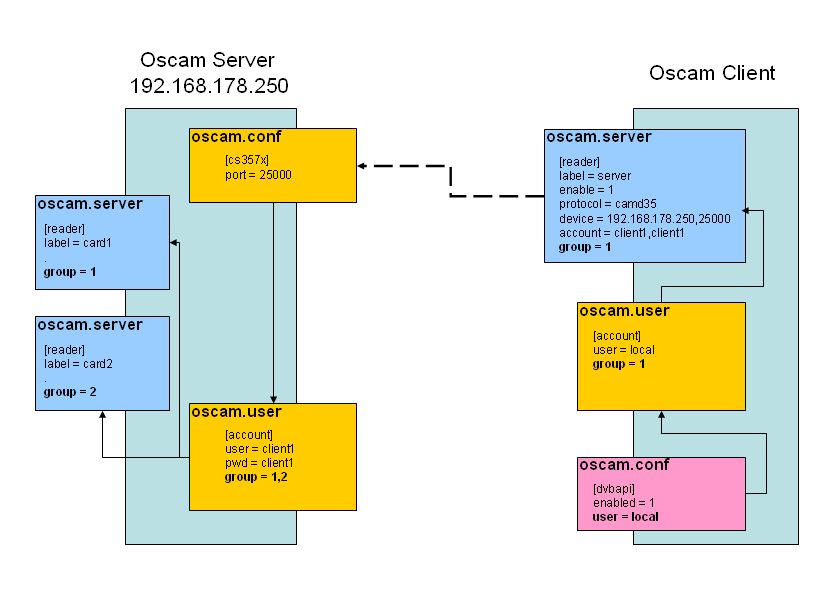

# What is OSCam?

## Overview

**OSCam** (Open Source Conditional Access Module) is a powerful, open-source software solution for managing conditional access systems. As a community-driven project developed by volunteers worldwide, OSCam provides a transparent and flexible platform for conditional access management across multiple devices and protocols.

## Open Source Philosophy

OSCam is **completely open source** and developed as a non-profit community project. The development process is transparent and publicly accessible:

- **Source Code**: Freely available on [GitLab](https://git.streamboard.tv/common/oscam)
- **Development Tracking**: Follow development progress through the [OSCam Timeline](https://git.streamboard.tv/common/oscam/-/commits/master?ref_type=HEADS)
- **Community Driven**: Contributions from developers worldwide
- **Cross-Platform**: Compile and run on multiple platforms and architectures

Originally developed as a card server, OSCam has evolved into a comprehensive solution that combines both server and client functionality, eliminating the need for closed-source alternatives.

## Key Features

### Card Server Capabilities

Like its predecessor MPCS, OSCam functions as a sophisticated protocol-agnostic card server, supporting multiple conditional access systems and communication protocols.

### Integrated Client

OSCam includes built-in client functionality controlled through DVB API parameters. This integrated approach offers several advantages:

- **Unified Solution**: Server and client from a single source
- **Full Transparency**: Complete control over data and commands
- **No External Dependencies**: No need for closed-source protocols
- **Streamlined Configuration**: Simplified setup and management

### Architecture Overview

OSCam's integrated architecture enables seamless communication between server and client components, providing efficient and reliable conditional access management.

## Modular Design

One of OSCam's strongest features is its **modular architecture**, which allows you to:

- **Minimize Memory Usage**: Select only the modules you need
- **Optimize Performance**: Reduce overhead on resource-constrained devices
- **Customize Functionality**: Build exactly what your setup requires

Module selection occurs during compilation, and active modules can be viewed in the `oscam.version` file through the web interface.

### Available Modules

OSCam supports a wide range of modules that can be enabled or disabled during compilation. Configure your build using the `config.sh` script.

#### Add-ons & Features

- **WEBIF** - Modern Web Interface for remote management
- **WEBIF_LIVELOG** - Real-time log viewing
- **WEBIF_JQUERY** - Enhanced UI with jQuery
- **WITH_COMPRESS_WEBIF** - Optimized webpage compression
- **WEBIF_WIKI** - Integrated Wiki Help
- **WITH_SSL** - Secure connections with OpenSSL
- **HAVE_DVBAPI** - DVB API integration
- **WITH_EXTENDED_CW** - Extended Control Word API
- **WITH_NEUTRINO** - Neutrino support
- **READ_SDT_CHARSETS** - SDT charset reading
- **CS_ANTICASC** - Anti-cascading protection
- **WITH_DEBUG** - Detailed debug logging
- **MODULE_MONITOR** - System monitoring
- **WITH_LB** - Intelligent load balancing
- **CS_CACHEEX** - Cache exchange system
- **CS_CACHEEX_AIO** - Advanced cache exchange
- **CW_CYCLE_CHECK** - Control word cycle verification
- **LCDSUPPORT** - LCD display support
- **LEDSUPPORT** - LED indicator support
- **CLOCKFIX** - System clock correction
- **IPV6SUPPORT** - IPv6 networking
- **WITH_ARM_NEON** - ARM NEON optimization
- **WITH_SIGNING** - Binary signing with X.509 certificates

#### Supported Protocols

- **MODULE_CAMD33** - Camd 3.3
- **MODULE_CAMD35** - Camd 3.5 UDP
- **MODULE_CAMD35_TCP** - Camd 3.5 TCP
- **MODULE_NEWCAMD** - Newcamd protocol
- **MODULE_CCCAM** - CCcam protocol
- **MODULE_CCCSHARE** - CCcam sharing
- **MODULE_GBOX** - Gbox protocol
- **MODULE_RADEGAST** - Radegast protocol
- **MODULE_SERIAL** - Serial communication
- **MODULE_CONSTCW** - Constant Control Word
- **MODULE_PANDORA** - Pandora protocol
- **MODULE_GHTTP** - HTTP-based protocol
- **MODULE_SCAM** - Scam protocol
- **MODULE_STREAMRELAY** - Stream relay functionality

#### Card Reader Support (CA Systems)

- **READER_NAGRA** - Nagravision
- **READER_NAGRA_MERLIN** - Nagra Merlin
- **READER_IRDETO** - Irdeto
- **READER_CONAX** - Conax
- **READER_CRYPTOWORKS** - Cryptoworks
- **READER_SECA** - Seca (Mediaguard)
- **READER_VIACCESS** - Viaccess
- **READER_VIDEOGUARD** - NDS Videoguard
- **READER_DRE** - DRE Crypt
- **READER_TONGFANG** - Tongfang
- **READER_BULCRYPT** - Bulcrypt
- **READER_GRIFFIN** - Griffin
- **READER_DGCRYPT** - DGCrypt

#### Card Reader Hardware

- **CARDREADER_PHOENIX** - Phoenix/Mouse readers
- **CARDREADER_INTERNAL** - Internal readers (Sci, Azbox, Cool)
- **CARDREADER_SC8IN1** - SC8in1
- **CARDREADER_MP35** - AD-Teknik MP 3.6/USB Phoenix
- **CARDREADER_SMARGO** - Argolis Smargo Smartreader
- **CARDREADER_DB2COM** - DreamBox 2
- **CARDREADER_STAPI** - STAPI interface
- **CARDREADER_STAPI5** - STAPI5 interface
- **CARDREADER_STINGER** - STINGER reader
- **CARDREADER_DRECAS** - DRECAS reader

## Getting Started

To explore OSCam's configuration options and build your custom version:

1. Visit the [OSCam repository](https://git.streamboard.tv/common/oscam)
2. Review the [config.sh](https://git.streamboard.tv/common/oscam/-/blob/master/config.sh) script
3. Select the modules that match your requirements
4. Compile OSCam for your target platform

For detailed installation and configuration instructions, see our [Installation Guide](../installation/requirements).
