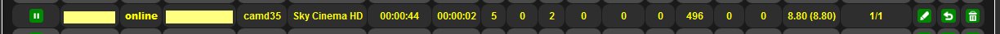
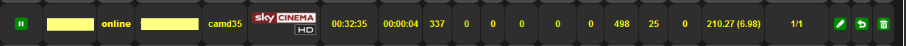
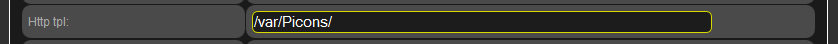

# Picons - Channel Display in WebIf

## Channel Display in WebIf

When you click on the Status or Users tabs in the WebIf, you typically see a display like this (depending on your style):



When using picons, which contain graphical channel logos, it looks like this:



You can enhance the channel information display in the WebInterface graphically by using picons. This requires at least OSCam build 1.20 #6678 or newer.

## Pre-made Picons

### Picons Project (Recommended)

The [Picons Project on GitHub](https://github.com/picons/picons) provides a comprehensive collection of channel logos for use with various applications including OSCam. This is the most up-to-date and actively maintained source for picons.

**Features:**
- Extensive collection of channel logos
- Multiple resolutions and styles available
- Regular updates with new channels
- Well-organized by provider and region
- Easy to download and install

**Quick Start:**
1. Visit [https://github.com/picons/picons](https://github.com/picons/picons)
2. Choose the appropriate picon set for your needs
3. Download and extract to your OSCam picons directory
4. Configure OSCam WebIf to use the picons (see implementation steps below)

### Community Picons

The OSCam community has created numerous custom picons for various providers over the years. Community members such as Darksniper, timeline, blacksnake, and hook have contributed significantly to the development of custom picon sets and styles.

**Community Resources:**
- Custom picon sets tailored for specific providers and regions
- Specialized styles and themes for WebIf integration
- Picon viewers and management tools
- Discussion forums for support and customization tips

You can find community-created picons and related discussions in the Streamboard forums. These community contributions may include:
- Provider-specific picon collections
- Custom WebIf styles optimized for picons
- Tools for viewing and managing picon collections
- Templates and guides for creating your own picons

### Implementing Picons

#### 1. Create a Storage Location for Picons on the Server

Depending on your server hardware and available storage space, choose an appropriate location with sufficient space. In this example, the directory is created here: `/var/Picons/`

#### 2. Upload Picons to the Directory

As mentioned in the services section, you should only upload the templates you need based on your smartcards or proxies. Servers with limited storage space would be overloaded if you upload all available templates following the "more is better" approach.

⚠️ **Warning:** If you use beta tunnels for A02 and S02 cards, you must upload not only the picons for CAID 1702 but also for CAID 1833!

#### 3. Configure WebIf Settings

Now you need to tell the WebIf where to find the picons. In our example, the line in the WebIf configuration looks like this:



**Configuration parameter:**
```ini
[webif]
httptpl = /var/Picons/
```

Don't forget to save and then trigger a restart either with F5 or manually!

#### 4. Enable Picons

For OSCam to display these picons, you need to enable them in the WebIf configuration:


**Enable in configuration:**
```ini
[webif]
httppiconpath = /var/Picons/
```

Don't forget to save and then trigger a restart either with F5 or manually!

## Creating Your Own Picons

If you're familiar with graphics and coding, you can create your own picons. However, many additional factors play a role, which are discussed in detail in the discussion thread. The desire for custom picons is often combined with redesigning the WebIf style. Some want to display their own server hardware on the main WebIf page, others prefer themes from movies or their favorite car.

Since all of this is a matter of personal taste, it would go too far to document all these special requests and methods here in the wiki. Interested users are welcome to add their approaches to this section!

## Configuration Parameters

### oscam.conf [webif] section

```ini
[webif]
httptpl         = /var/Picons/      # Path to template/picon directory
httppiconpath   = /var/Picons/      # Path to picons (enables picon display)
```

## Requirements

- OSCam build 1.20 #6678 or newer
- Sufficient storage space on the server
- Compatible WebIf style (recommended: `skin-colorbutton.css` or `blacksnake_grey@timeline.css`)

## Best Practices

1. **Storage Optimization**: Only upload picons for the channels/providers you actually use
2. **Beta Tunnels**: Don't forget to upload picons for both CAIDs if using beta tunnels
3. **Style Compatibility**: Use modern styles that are optimized for picons
4. **Backup**: Keep a backup of your picons and configuration
5. **Testing**: After configuration changes, always restart OSCam to apply changes